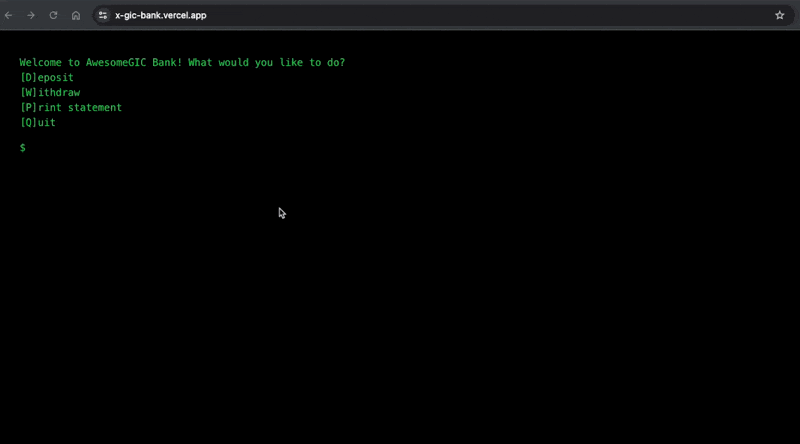
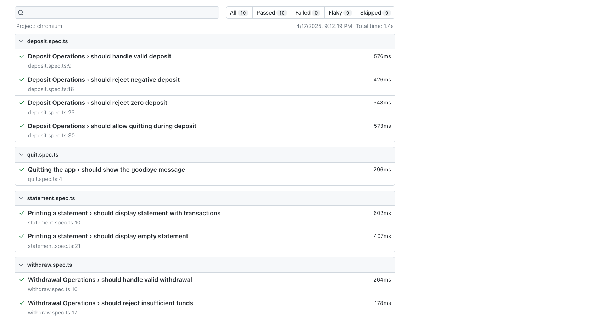
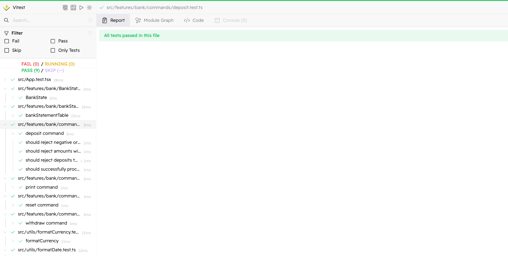

# X-GIC Bank

- Demo: [X-GIC-Bank](http://x-gic-bank.vercel.app/)
- Explanation of submission: [Daryll's Notion](https://daryllxd.notion.site/gic-demo)




## Setup Instructions

```
$ brew install pnpm # Install pnpm
$ pnpm install
$ pnpm dev          # Runs app at localhost:5173
```

## Architecture

This is is just a drawing - more in the [Daryll's Notion](https://daryllxd.notion.site/gic-demo)


## Testing

### Playwright Tests

Playwright tests are located in the `tests` directory. To run the tests:

```bash
pnpm test:e2e
```

This will start the Playwright test runner at http://localhost:9323/



### Vitest Tests

Unit tests are written using Vitest and are located in the `src` directory. To run the tests:

```bash
pnpm test
pnpm test:ui
```

This will start the Vitest test runner at http://localhost:51204/


